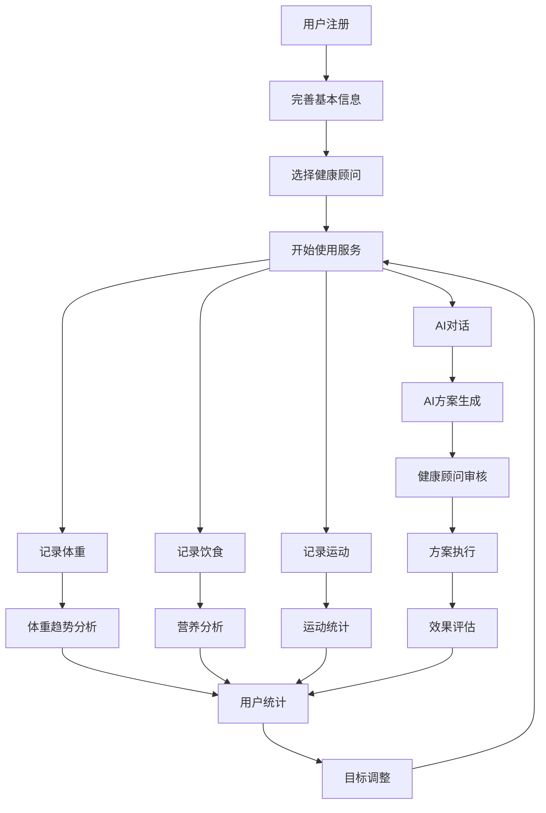

# 体重管理数字医生小程序 - 数据库ER图（MySQL版）

**文档版本**：v1.0  
**创建日期**：2025年8月8日  
**最后更新**：2025年8月8日

---

## 1. ER图概述

本文档展示了体重管理数字医生小程序MySQL数据库的实体关系图，包含18个核心表及其关系。

---

## 2. 完整ER图

```mermaid
erDiagram
    %% 核心用户实体
    USERS {
        bigint id PK
        varchar openid UK
        varchar unionid UK
        varchar nickname
        varchar real_name
        varchar avatar
        varchar phone UK
        varchar email UK
        enum gender
        tinyint age
        date birth_date
        decimal height
        decimal current_weight
        decimal target_weight
        decimal bmi
        varchar occupation
        enum activity_level
        json health_goals
        json medical_history
        json dietary_restrictions
        json allergies
        varchar preferred_language
        varchar timezone
        bigint advisor_id FK
        enum member_level
        datetime member_expire
        enum status
        json notification_settings
        json privacy_settings
        datetime last_login
        int login_count
        datetime created_at
        datetime updated_at
    }

    %% 健康顾问实体
    ADVISORS {
        bigint id PK
        varchar name
        varchar avatar
        varchar phone UK
        varchar email UK
        varchar id_card UK
        varchar license_number UK
        json specialty
        json specialization
        varchar qualification
        varchar education
        text work_experience
        varchar hospital
        text description
        tinyint experience_years
        int consultation_fee
        int user_count
        decimal rating
        bigint total_income
        bigint monthly_income
        enum status
        enum verification_status
        tinyint is_online
        int max_users
        int max_daily_consultations
        int response_time
        json available_time
        json service_areas
        json languages
        json certificates
        datetime created_at
        datetime updated_at
    }

    %% 体重记录实体
    WEIGHT_RECORDS {
        bigint id PK
        bigint user_id FK
        decimal weight
        decimal bmi
        date record_date
        datetime record_time
        enum record_type
        varchar photo_url
        text note
        json device_info
        json location
        datetime created_at
        datetime updated_at
    }

    %% 饮食记录实体
    DIET_RECORDS {
        bigint id PK
        bigint user_id FK
        varchar food_name
        varchar food_category
        decimal quantity
        varchar unit
        decimal calories
        decimal protein
        decimal fat
        decimal carbs
        decimal fiber
        decimal sugar
        decimal sodium
        varchar photo_url
        enum meal_type
        date record_date
        datetime record_time
        enum record_type
        decimal ai_confidence
        text note
        datetime created_at
        datetime updated_at
    }

    %% 运动记录实体
    EXERCISE_RECORDS {
        ObjectId _id PK
        ObjectId user_id FK
        String exercise_type
        String exercise_name
        Number duration
        String intensity
        Number calories_burned
        Number distance
        Number steps
        Object heart_rate
        String photo_url
        Date record_date
        Date record_time
        String record_type
        Object device_info
        Object location
        String note
        Date created_at
        Date updated_at
    }

    %% AI方案实体
    AI_PLANS {
        bigint id PK
        bigint user_id FK
        bigint advisor_id FK
        varchar plan_name
        enum plan_type
        decimal target_weight
        int duration
        decimal expected_loss
        int daily_calories
        json diet_plan
        json exercise_plan
        json lifestyle_plan
        enum status
        text review_comment
        int review_fee
        datetime reviewed_at
        bigint reviewed_by
        enum execution_status
        date start_date
        date end_date
        datetime created_at
        datetime updated_at
    }

    %% 聊天记录实体
    CHAT_MESSAGES {
        bigint id PK
        bigint user_id FK
        bigint advisor_id FK
        enum sender_type
        enum message_type
        text content
        varchar image_url
        varchar file_url
        varchar file_name
        bigint file_size
        tinyint is_read
        datetime read_at
        tinyint is_deleted
        datetime deleted_at
        datetime created_at
        datetime updated_at
    }

    %% 审核记录实体
    REVIEW_RECORDS {
        ObjectId _id PK
        ObjectId plan_id FK
        ObjectId user_id FK
        ObjectId advisor_id FK
        String review_type
        String review_status
        String review_comment
        Array modification_suggestions
        Number review_fee
        String fee_status
        Number review_time
        Date created_at
        Date reviewed_at
        Date updated_at
    }

    %% 支付记录实体
    PAYMENT_RECORDS {
        bigint id PK
        bigint user_id FK
        varchar order_id UK
        varchar transaction_id UK
        enum payment_type
        int amount
        varchar currency
        enum status
        varchar payment_method
        varchar description
        bigint related_id
        int refund_amount
        varchar refund_reason
        datetime refund_time
        datetime created_at
        datetime paid_at
        datetime updated_at
    }

    %% 食物数据库实体
    FOOD_DATABASE {
        ObjectId _id PK
        String food_name
        String food_category
        String food_subcategory
        Number calories_per_100g
        Number protein_per_100g
        Number fat_per_100g
        Number carbs_per_100g
        Number fiber_per_100g
        Number sugar_per_100g
        Number sodium_per_100g
        Number vitamin_a
        Number vitamin_c
        Number vitamin_d
        Number vitamin_e
        Number calcium
        Number iron
        Number zinc
        Array common_units
        String image_url
        String description
        Array tags
        Boolean is_active
        Array search_keywords
        Date created_at
        Date updated_at
    }

    %% 运动数据库实体
    EXERCISE_DATABASE {
        ObjectId _id PK
        String exercise_name
        String exercise_category
        String exercise_subcategory
        Number calories_per_hour
        String intensity_level
        Array equipment_needed
        Array target_muscles
        String difficulty_level
        Object duration_range
        String instructions
        Array precautions
        Array benefits
        String video_url
        String image_url
        Array tags
        Boolean is_active
        Array search_keywords
        Date created_at
        Date updated_at
    }

    %% 目标设定实体
    USER_GOALS {
        ObjectId _id PK
        ObjectId user_id FK
        String goal_type
        String goal_name
        Number target_weight
        Number current_weight
        Number start_weight
        Date target_date
        Number weekly_loss_target
        Number daily_calorie_target
        Number daily_protein_target
        Number daily_fat_target
        Number daily_carbs_target
        Number exercise_minutes_target
        Number water_intake_target
        Number steps_target
        String status
        Number progress_percentage
        Date start_date
        Date end_date
        String notes
        Date created_at
        Date updated_at
    }

    %% 用户统计实体
    USER_STATISTICS {
        ObjectId _id PK
        ObjectId user_id FK
        Date stat_date
        Number total_calories
        Number total_protein
        Number total_fat
        Number total_carbs
        Number total_fiber
        Number total_sugar
        Number total_sodium
        Number total_exercise_minutes
        Number total_calories_burned
        Number weight_change
        Number steps_count
        Number water_intake
        Number sleep_hours
        Number meal_count
        Number exercise_count
        Number weight_record_count
        Number ai_chat_count
        Object goal_progress
        Date created_at
        Date updated_at
    }

    %% 通知实体
    NOTIFICATIONS {
        ObjectId _id PK
        ObjectId user_id FK
        ObjectId advisor_id FK
        String notification_type
        String title
        String content
        String image_url
        String action_url
        String action_type
        String priority
        Boolean is_read
        Date read_at
        Boolean is_sent
        Date sent_at
        Date scheduled_at
        Date expire_at
        Date created_at
        Date updated_at
    }

    %% 用户反馈实体
    USER_FEEDBACK {
        ObjectId _id PK
        ObjectId user_id FK
        String feedback_type
        String category
        String title
        String content
        Number rating
        Array images
        Object contact_info
        String status
        String priority
        ObjectId assigned_to
        String admin_reply
        Date reply_at
        Date resolved_at
        Array tags
        Date created_at
        Date updated_at
    }

    %% 审计日志实体
    AUDIT_LOGS {
        ObjectId _id PK
        ObjectId user_id FK
        ObjectId advisor_id FK
        String action
        String resource_type
        ObjectId resource_id
        Object old_value
        Object new_value
        Array changed_fields
        String ip_address
        String user_agent
        String session_id
        String request_id
        Number execution_time
        String status
        String error_message
        Date created_at
    }

    %% 系统配置实体
    SYSTEM_CONFIGS {
        bigint id PK
        varchar config_key UK
        json config_value
        enum config_type
        varchar description
        varchar category
        tinyint is_active
        datetime created_at
        datetime updated_at
    }

    %% 操作日志实体
    OPERATION_LOGS {
        ObjectId _id PK
        ObjectId user_id FK
        ObjectId advisor_id FK
        String operation_type
        String operation_name
        String resource_type
        ObjectId resource_id
        Object request_data
        Object response_data
        String ip_address
        String user_agent
        String status
        String error_message
        Number execution_time
        Date created_at
    }

    %% 关系定义
    USERS ||--o{ WEIGHT_RECORDS : "has"
    USERS ||--o{ DIET_RECORDS : "has"
    USERS ||--o{ EXERCISE_RECORDS : "has"
    USERS ||--o{ AI_PLANS : "has"
    USERS ||--o{ CHAT_MESSAGES : "sends"
    USERS ||--o{ PAYMENT_RECORDS : "makes"
    USERS ||--o{ USER_GOALS : "sets"
    USERS ||--o{ USER_STATISTICS : "has"
    USERS ||--o{ NOTIFICATIONS : "receives"
    USERS ||--o{ USER_FEEDBACK : "submits"
    USERS ||--o{ AUDIT_LOGS : "generates"

    ADVISORS ||--o{ USERS : "manages"
    ADVISORS ||--o{ AI_PLANS : "reviews"
    ADVISORS ||--o{ REVIEW_RECORDS : "performs"
    ADVISORS ||--o{ CHAT_MESSAGES : "sends"
    ADVISORS ||--o{ NOTIFICATIONS : "sends"
    ADVISORS ||--o{ AUDIT_LOGS : "generates"

    FOOD_DATABASE ||--o{ DIET_RECORDS : "references"
    EXERCISE_DATABASE ||--o{ EXERCISE_RECORDS : "references"

    AI_PLANS ||--|| REVIEW_RECORDS : "has"
    AI_PLANS ||--|| USER_GOALS : "creates"
```



---

## 3. 实体关系说明

### 3.1 主要关系

1. **用户关系**：
   - 用户可以有多个体重记录、饮食记录、运动记录
   - 用户可以有多个AI方案、聊天记录、支付记录
   - 用户可以有多个目标设定、统计数据、通知、反馈

2. **健康顾问关系**：
   - 健康顾问可以管理多个用户
   - 健康顾问可以审核多个AI方案
   - 健康顾问可以发送多个聊天消息和通知

3. **数据引用关系**：
   - 饮食记录引用食物数据库
   - 运动记录引用运动数据库
   - AI方案与审核记录一对一关系

### 3.2 关键约束

1. **唯一性约束**：
   - 用户openid、手机号、邮箱唯一
   - 健康顾问手机号、身份证号、执业证书号唯一
   - 支付订单ID、交易ID唯一
   - 系统配置键唯一

2. **外键约束**：
   - 所有记录必须关联有效用户
   - 健康顾问相关记录必须关联有效顾问
   - 审核记录必须关联有效AI方案

3. **数据完整性**：
   - 用户删除时级联删除相关记录
   - 健康顾问删除时更新用户关联
   - 敏感数据加密存储

---

## 4. 索引策略

### 4.1 主要索引

```sql
-- 用户相关索引
USERS: [
  UNIQUE KEY uk_openid (openid),
  UNIQUE KEY uk_phone (phone),
  UNIQUE KEY uk_email (email),
  KEY idx_advisor_id (advisor_id),
  KEY idx_member_level (member_level),
  KEY idx_status (status),
  KEY idx_activity_level (activity_level),
  KEY idx_bmi (bmi)
]

-- 记录相关索引
WEIGHT_RECORDS: [
  KEY idx_user_id_record_date (user_id, record_date),
  KEY idx_user_id_created_at (user_id, created_at),
  KEY idx_record_type (record_type)
]

DIET_RECORDS: [
  KEY idx_user_id_record_date (user_id, record_date),
  KEY idx_user_id_meal_type_record_date (user_id, meal_type, record_date),
  KEY idx_meal_type (meal_type)
]

EXERCISE_RECORDS: [
  KEY idx_user_id_record_date (user_id, record_date),
  KEY idx_user_id_exercise_type (user_id, exercise_type),
  KEY idx_exercise_type (exercise_type)
]

-- 聊天相关索引
CHAT_MESSAGES: [
  KEY idx_user_id_advisor_id_created_at (user_id, advisor_id, created_at),
  KEY idx_advisor_id_user_id_created_at (advisor_id, user_id, created_at),
  KEY idx_is_read (is_read)
]

-- 全文搜索索引
FOOD_DATABASE: [
  FULLTEXT KEY ft_food_search (food_name, search_keywords)
]

EXERCISE_DATABASE: [
  FULLTEXT KEY ft_exercise_search (exercise_name, search_keywords)
]
```

### 4.2 分表策略

```sql
-- 按月分表的表
SET @MONTHLY_PARTITIONS = [
  'weight_records',
  'diet_records', 
  'exercise_records',
  'chat_messages',
  'user_statistics',
  'operation_logs',
  'audit_logs'
];

-- 分表命名规则
DELIMITER $$
CREATE FUNCTION getPartitionName(baseName VARCHAR(50), dateParam DATE) 
RETURNS VARCHAR(100)
DETERMINISTIC
BEGIN
    DECLARE yearStr VARCHAR(4);
    DECLARE monthStr VARCHAR(2);
    DECLARE tableName VARCHAR(100);
    
    SET yearStr = YEAR(dateParam);
    SET monthStr = LPAD(MONTH(dateParam), 2, '0');
    SET tableName = CONCAT(baseName, '_', yearStr, monthStr);
    
    RETURN tableName;
END$$
DELIMITER ;
```

---

## 5. 数据流向图



---

## 6. 总结

这个ER图展示了体重管理数字医生小程序完整的MySQL数据库结构：

1. **18个核心表**：涵盖所有业务功能
2. **清晰的关系定义**：一对一、一对多、多对多关系明确
3. **完整的约束设计**：唯一性、外键、数据完整性约束
4. **优化的索引策略**：复合索引、全文索引、唯一索引
5. **分表策略**：按时间分表提高性能
6. **数据流向**：完整的业务流程数据流转

这个MySQL数据库设计能够完全支撑PRD文档中的所有功能需求，确保系统的高效、安全、可扩展运行。
